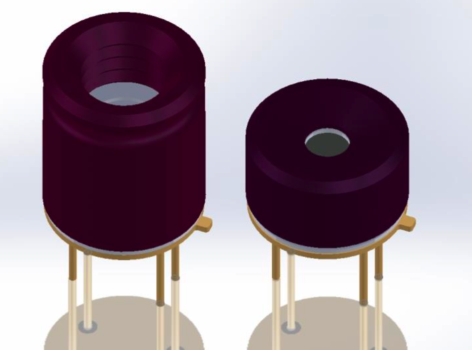
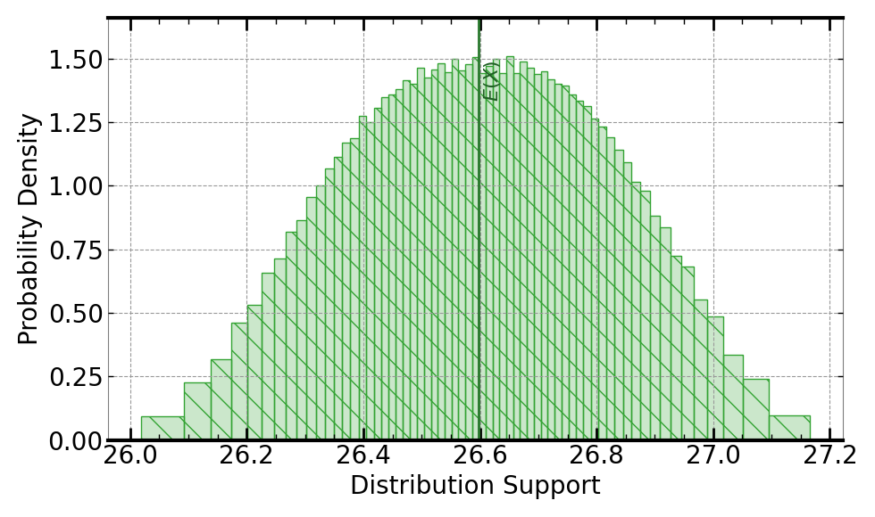

[](https://signaloid.io/repositories?connect=https://github.com/signaloid/Signaloid-Demo-Sensors-MLX90640ConversionRoutines#gh-dark-mode-only)
[](https://signaloid.io/repositories?connect=https://github.com/signaloid/Signaloid-Demo-Sensors-MLX90640ConversionRoutines#gh-light-mode-only)

# Example: MLX90640 Conversion Routines

Modern sensors use transducers to convert the physical signal they want to measure, into a voltage signal which is then
digitized using analog-to-digital converters (ADC).
Systems integrating these sensors use calibration algorithms specific to the sensor to convert this digital voltage signal 
to a meaningful measurement of the physical signal (e.g., a temperature in degrees Celsius).
Even if the measured signal stays fixed, the digitized value will fluctuate. 
Systems incorporating sensors today workaround this _uncertainty_ by averaging the signal over a time period to get a single number. 
This example shows how uncertainty-tracking computing systems can let you get a more realistic view of
what a sensor is really measuring, by tracking how uncertainties in a sensor's raw digitized 
ADC readings, as well as uncertainties in other calibration
parameters, affect an unmodified version of the sensor calibration algorithm of one
commercially-available thermal sensor array, MLX90640 from Melexis[^0].



## Getting started

The correct way to clone this repository to get the submodules is:
```sh
	git clone --recursive git@github.com:signaloid/Signaloid-Demo-Sensors-MLX90640ConversionRoutines.git
```

If you forgot to clone with `--recursive` and end up with empty submodule directories, you can remedy this with:
```sh
	git submodule update --init
```

## Inputs:

The inputs to the MLX90640 sensor conversion algorithms are the raw ADC readings taken from the
sensor array (32*24 pixels), the expected emissivity of the measurand, and the internal calibration
parameters of the sensor. The algorithm models the ADC quantization error using a uniform
distribution. For ADC value `x`, the corresponding
floating point value is calculated as `UniformDist(x-0.5, x+0.5)`.
The uncertainty in the emissivity parameter is also modeled using a uniform (`UniformDist(0.93, 0.97)`).

## Output:

Running this application with default parameters will calculate the temperature of the center pixel, assuming that 
the emissivity is uniformly distributed between (0.93, 0.97) while also modeling the ADC quantization error. 
Following is the output:




## Usage:
```
Usage: Valid command-line arguments are:
	[-i, --input <Path to input CSV file : str>] (Read inputs from file.)
	[-o, --output <Path to output CSV file : str>] (Specify the output file.)
	[-W, --write-file] (Writes the output to the output file. Use '-o' specify this file path.)
	[-S, --select-output <output : int (Default: 0)>] (Compute 0-indexed output.)
	[-M, --multiple-executions <Number of executions : int (Default: 1)>] (Repeated execute kernel for benchmarking.)
	[-T, --time] (Timing mode: Times and prints the timing of the kernel execution.)
	[-v, --verbose] (Verbose mode: Prints extra information about demo execution.)
	[-b, --benchmarking] (Generate outputs in format for benchmarking.)
	[-j, --json] (Print output in json format.)
	[-h, --help] (Display this help message.)
	[-c, --ee-data <path to sensor ee constants file: str (Default: 'EEPROM-calibration-data.csv')>]
	[-e, --emissivity <emissivity : float (Default: 'UniformDist(0.93, 0.97)')>]
	[-q, --quantization-error] (Disable ADC quantization error.)
	[-p, --pixel <Selected pixel : int, range = [0,767] (Default: '400')>]
	[-a, --print-all-temperatures] (Print all temperature measurements.)
```


## Repository Structure

This repository contains a wrapper to the original calibration routines from the sensor's
manufacturer, along with a set of patches to allow us to read the ADC readings from a file for this
example, rather than reading them from an I2C- or SPI-connected sensor.

---

[^0]: Melexis, [MLX90640 Datasheet](https://www.melexis.com/en/product/MLX90640/Far-Infrared-Thermal-Sensor-Array).

