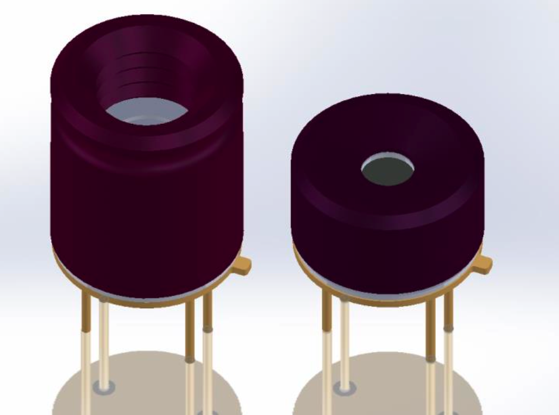
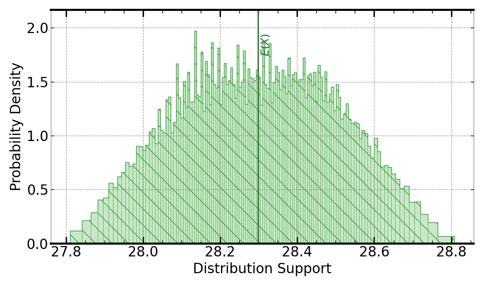

[](https://signaloid.io/repositories?connect=https://github.com/signaloid/Signaloid-Demo-Sensors-MLX90640ConversionRoutines#gh-dark-mode-only)
[](https://signaloid.io/repositories?connect=https://github.com/signaloid/Signaloid-Demo-Sensors-MLX90640ConversionRoutines#gh-light-mode-only)

# Example: MLX90640 Conversion Routines

Modern sensors use transducers to convert the physical signal they want to measure, into a voltage signal which is then
digitized using analog-to-digital converters (ADC).
Systems integrating these sensors use calibration algorithms specific to the sensor to convert this digital voltage signal
to a meaningful measurement of the physical signal (e.g., a temperature in degrees Celsius).
Even if the measured signal stays fixed, the digitized value will fluctuate.
Systems incorporating sensors today workaround this _uncertainty_ by averaging the signal over a time period to get a single number.
This example shows how uncertainty-tracking computing systems can let you get a more realistic view of
what a sensor is really measuring, by tracking how uncertainties in a sensor's raw digitized
ADC readings, as well as uncertainties in other calibration
parameters, affect an unmodified version of the sensor calibration algorithm of one
commercially-available thermal sensor array, MLX90640 from Melexis[^0].



## Getting started

The correct way to clone this repository to get the submodules is:
```sh
	git clone --recursive git@github.com:signaloid/Signaloid-Demo-Sensors-MLX90640ConversionRoutines.git
```

If you forgot to clone with `--recursive` and end up with empty submodule directories, you can remedy this with:
```sh
	git submodule update --init
```

## Running the application on the Signaloid Cloud Developer Platform
To run this application on the [Signaloid Cloud Developer Platform](https://signaloid.io),
you need a Signaloid account. You can sign up for a Signaloid account using [this link](https://get.signaloid.io).

Once you have a Signaloid account, click the "add to signaloid.io" button at the
top of this README to connect this repository to the Signaloid Cloud Developer Platform
and run the application.

## Running the application locally
You can also compile and run this application locally to perform a native Monte Carlo simulation (uses GNU Scientific Library (GSL)[^1] to generate samples for the different input distributions).
In the Monte-Carlo mode the application stores the generated output samples in a file `data.out`.
The first line of `data.out` contains the execution time of the Monte Carlo implementation in microseconds (μs). Following lines contain floating-point values corresponding to output sample values.
For the Monte Carlo output mode, you must select a single output
to calculate using the `-S` command-line option.

### Prerequisites

The native build needs GNU Make, a C compiler, and the GNU Scientific Library (GSL).

On macOS, install the Xcode Command Line Tools (which provide `make` and the C
compiler) and then install GSL with [Homebrew](https://brew.sh):
```bash
xcode-select --install
brew install gsl
```

On Linux (Debian/Ubuntu):
```bash
sudo apt-get install -y build-essential libgsl-dev
```

The top-level `Makefile` detects the GSL install location automatically, covering
Homebrew on Apple Silicon (`/opt/homebrew`), Homebrew on Intel (`/usr/local`) and
MacPorts (`/opt/local`), so no further configuration is needed on macOS.

In order to compile and run this application in the native Monte Carlo mode:

1. Compile natively, from the repository root:
```
make local-build
```
This builds the `demo-native-mc` binary at the repository root.
2. Run the application in the MonteCarlo mode, using (`-M`) command-line option. Run it from the
repository root. The application reads `EEPROM-calibration-data.csv` and `raw-frame-data.csv` using
paths relative to the current working directory, and both are symlinked into the repository root (and
into `src/`, for the Signaloid cloud build) from `inputs/`:
```
./demo-native-mc -M 10000 -S 0
```
The above program runs 10000 Monte Carlo iterations, calculating the output chosen by (`-S 0`) command-line option.
3. See the output samples generated by the local Monte Carlo execution:
```
cat data.out
```

## Inputs:

The inputs to the MLX90640 sensor conversion algorithms are the raw ADC readings taken from the
sensor array (32*24 pixels), the expected emissivity of the measurand, and the internal calibration
parameters of the sensor. The algorithm models the ADC quantization error using a uniform
distribution. For ADC value `x`, the corresponding
floating point value is calculated as `UniformDist(x-0.5, x+0.5)`.
The uncertainty in the emissivity parameter is also modeled using a uniform (`UniformDist(0.93, 0.97)`).

## Output:

Running this application with default parameters will calculate the temperature of the center pixel, assuming that
the emissivity is uniformly distributed between (0.93, 0.97) while also modeling the ADC quantization error.

Example output using Signaloid's C0Pro-S core:




## Usage:
```
Usage: Valid command-line arguments are:
	[-i, --input <Path to input CSV file : str>] (Read inputs from file.)
	[-o, --output <Path to output CSV file : str>] (Specify the output file.)
	[-S, --select-output <output : int>] (Compute 0-indexed output, by default 0.)
	[-M, --multiple-executions <Number of executions : int (Default: 1)>] (Repeated execute kernel for benchmarking.)
	[-T, --time] (Timing mode: Times and prints the timing of the kernel execution.)
	[-v, --verbose] (Verbose mode: Prints extra information about demo execution.)
	[-b, --benchmarking] (Benchmarking mode: Generate outputs in format for benchmarking.)
	[-j, --json] (Print output in JSON format.)
	[-h, --help] (Display this help message.)
	[-c, --ee-data <path to sensor ee constants file: str (Default: 'EEPROM-calibration-data.csv')>]
	[-e, --emissivity <emissivity : float (Default: 'UniformDist(0.93, 0.97)')>]
	[-q, --quantization-error] (Disable ADC quantization error.)
	[-p, --pixel <Selected pixel : int, range = [0,767] (Default: '400')>]
	[-a, --print-all-temperatures] (Print all temperature measurements.)
```


## Repository Structure

This repository contains a wrapper to the original calibration routines from the sensor's
manufacturer, along with a set of patches to allow us to read the ADC readings from a file for this
example, rather than reading them from an I2C- or SPI-connected sensor.

---

[^0]: Melexis, [MLX90640 Datasheet](https://www.melexis.com/en/product/MLX90640/Far-Infrared-Thermal-Sensor-Array).
[^1]: [GNU Scientific Library](https://www.gnu.org/software/gsl/).

